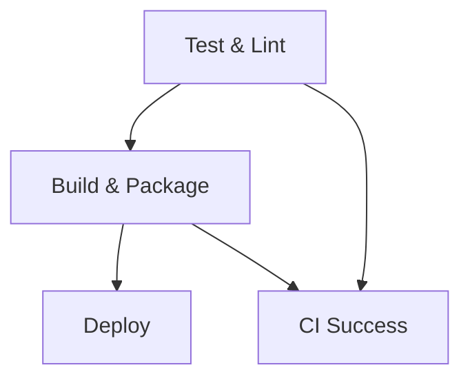

# Workflow CI/CD Overview

## 🎯 **Main CI/CD Pipeline** (`main.yml`)

### **Triggers:**
- `push` to `main`, `develop` branches
- `pull_request` to `main`, `develop` 
- `workflow_dispatch` (manual trigger)
- Only when relevant files change (apps/web-antd, packages, deploy scripts)

### **Jobs Flow:**



## 🔧 **Job Details:**

### 1. **Test & Lint** (20 min timeout)
- ✅ ESLint code quality
- ✅ TypeScript type checking  
- ✅ Unit tests with Vitest
- **Runs on**: Ubuntu Latest

### 2. **Build & Package** (15 min timeout)
- ✅ Build HRMS app (`@vben/web-antd`)
- ✅ Login to GitHub Container Registry
- ✅ Build multi-arch Docker image (amd64 + arm64)
- ✅ Push to `ghcr.io/ynkdqe/vue-vben-hrms:latest`

### 3. **Deploy** (Production only)
- **Condition**: Only `main` branch + push event
- **Environment**: `production` (requires approval if configured)
- ✅ Upload `deploy-blue-green.sh` to VPS
- ✅ Execute blue-green deployment (zero downtime)
- ✅ Health check + rollback capability

### 4. **CI Success**
- ✅ Overall status check
- ✅ Fail if any previous job fails

## 🐳 **Docker Configuration:**

### **Image Details:**
```bash
Registry: ghcr.io/ynkdqe/vue-vben-hrms
Tags: latest, {git-sha}
Platforms: linux/amd64, linux/arm64
Build Args: GIT_SHA, BUILD_NUMBER
```

### **Container Config:**
```bash
Service: hrms-app
Internal Port: 8080 (nginx)
External Ports: 8205 (blue), 8206 (green)
Public Port: 8080 (nginx proxy)
Health Check: /health
```

## 🔐 **Required Secrets:**

### **GitHub Repository Secrets:**
- `VPS_IP`: VPS IP address or domain
- `VPS_USER`: SSH username (e.g., ubuntu, root)
- `VPS_SSH_KEY`: Private SSH key content for VPS access
- `GITHUB_TOKEN`: Auto-provided for GHCR

### **Example Setup:**
```bash
# Generate SSH key pair
ssh-keygen -t rsa -b 4096 -f ~/.ssh/vps_hrms_key

# Copy public key to VPS
ssh-copy-id -i ~/.ssh/vps_hrms_key.pub user@your-vps-ip

# Add private key to GitHub Secrets
cat ~/.ssh/vps_hrms_key
# Copy output to GitHub > Settings > Secrets > VPS_SSH_KEY
```

## 🚀 **Deployment Process:**

### **Blue-Green Strategy:**
1. **Detect** current active container (blue/green)
2. **Deploy** new version to inactive slot
3. **Health Check** new container
4. **Switch** nginx upstream to new container  
5. **Cleanup** old container

### **Zero Downtime:**
- Users continue accessing old version during deployment
- Traffic switches only after new version is healthy
- Automatic rollback if health checks fail

## 📊 **Monitoring & Access:**

### **After Deployment:**
```bash
# Check status
http://your-vps-ip:8080/health

# HRMS Application  
http://your-vps-ip:8080

# Container logs
docker logs hrms-app-blue
docker logs hrms-app-green
```

### **Manual Operations:**
```bash
# Check active container
cat /var/run/hrms-app-active

# Manual deploy (on VPS)
/usr/local/bin/deploy-hrms.sh ghcr.io/ynkdqe/vue-vben-hrms:latest hrms-app 8080 /health
```

## ⚡ **Performance Features:**

- **Concurrency Control**: Cancel old runs when new push
- **Conditional Deployment**: Only deploy on main branch
- **Multi-platform Images**: Support both x64 and ARM VPS
- **Docker Layer Caching**: Faster subsequent builds
- **Resource Limits**: 512MB memory, 0.5 CPU per container

## 🔄 **Workflow:**

```bash
# Development
git push origin feature/my-feature  # → Test + Lint + Build
git push origin develop             # → Test + Lint + Build

# Production  
git push origin main                # → Test + Lint + Build + Deploy
```

This setup provides enterprise-grade CI/CD with zero-downtime deployments for your HRMS application! 🎉
